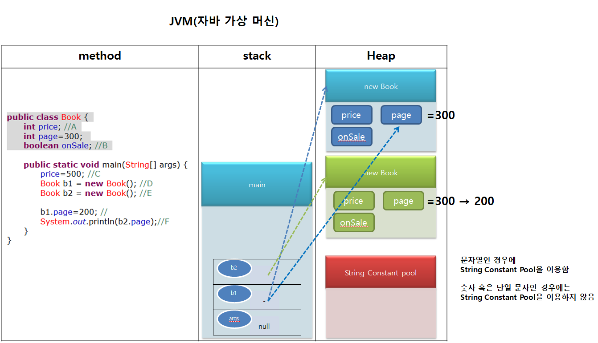

class Duck{

    public "반환여부"(void) 메서드(){
        System.out.println("오리가 날아갑니다");
    }

    public int getEgg(){
        return 5;
    }
}

반환여부에 들어올 수 있는 종류 = 4가지
문자, 숫자, 논리값, 객체

void=반환여부를 정하지 않은 것을 의미

클래스를 컴파일하면 .java 원본 소스로부터 컴파일 됨
그러나, java.exe를 실행해야 기계어 파일이 생성되면서 메모리가 올라감

java로 만들어진 프로그램 실행 시 곧바로 실행되지 않는 이유?
프로그램은 HDD에 저장되어 있으나, cpu는 hdd가 아닌 메모리에서 프로그램을 불러오기 때문에, 프로그램을 HDD에서 메모리에 올리는 사전과정이 필요함 ("로딩")

-------------------------------------------------------------------
class Dog{
	String name="rocky";
	int age=3;
	
	public void run(){
		System.out.println(name+"가 달립니다");
	}
}

class UseDog{
	public static void main(String[] args){
		Dog.age=5; (A)
		
		Dog d = new Dog();
		d.run();
		
		System.out.println(name+"가 달립니다");
	}
}

(A)에서는 Dog 클래스가 보유한 age 변수를 

실행부는 멤버가 아님
멤버는 변수와 함수
class Dog에서 멤버는 총 세 가지 (변수 두 가지와 함수 한 가지)

JVM OS로부터 메모리를 얻어오면, 할당된 메모리를 3단계로 나누어 사용함 (1.method 영역, 2.stack 영역, 3.heap 영역)

## 학습 정리 퀴즈
(1) 클래스가 객체를 설계한 것이라면, 실행 타임(=Runtime)시 메모리에 올라가는 객체 한 단위를 인스턴스(instance)라고 한다.
(2) Car a=new Car() 에서 a 변수에는 객체의 주소값이 담겨 있다. 이렇게 객체의 주소값을 가지는 변수를  레퍼런스(reference) 변수라고 한다.
(3) 객체 생성 후 프로그래머가 따로 메모리 관리를 해주지 않아도 자동으로 사용되지 않는 인스턴스들을 소멸시키는 JVM의 메모리 청소 기능을 가비지컬렉션(garbage Collection) 이라 한다.
(4) 메인 메서드는 개발자가 직접 호출 할 수 없으며 명령 프롬프트에서 자바(java.exe) 파일 실행 시 자동 호출된다.
(5) 레퍼런스 변수 값을 출력해보면 @ 형태의 데이터가 출력되는데, 이것은 객체 자체의 값이 아니라 그 객체의 (주소) 값이다.
(6) 클래스로부터 생성되는 인스턴스가 메모리에 올라갈 때 클래스에 작성된 멤버(memeber)변수 중 인스턴스 변수는 각각의 인스턴스 마다 할당되어 진다
(7) JVM 도 프로그램 이므로 운영체제(OS)로 부터 메모리를 할당 받아 사용한다. 이때 JVM 에서는 메모리 영역을 크게 메서드(method), 스택(stack), 힙(heap) 영역으로 분리하여 운영한다
(8) 객체 생성 시 프로그래머의 의도와는 상관없이 new 연산자 뒤에서 무조건 호출되는 메서드를 (생성자 메서드) 라고 하는데, 반드시 클래스명과 명칭이 동일해야 하며, 절대로 반환형을 두어서는 안된다
(9) 현실의 사물을 객체(=오브젝트)을 Java 언어로 모델링 한 설계도를 클래스(class)라 하며, 이로 부터 메모리에 생성된 객체 한 단위를 인스턴스(instance)라 한다.
(10) 같은 클래스 내에 작성된 변수를 멤버(member) 변수, 메서드를 멤버(member) 메서드 라 한다.
(11) 클래스 코드는 JVM 메모리 영역 중 메서드(method) 영역에 로드 되는데 , 로드 시점은 클래스를 (실행할 때) 이다.
(12) 모든 메서드 내의 매개변수를 포함한 지역변수는 메서드 호출 시 JVM의 메모리 영역 중 스택(stack) 영역에 생성 및 관리된다
(13) Car a = new Car() 에 의해 생성된 Car 객체의 인스턴스는 JVM의 메모리 영역 중 힙(heap) 영역에 생성 및 관리된다

static 자료형 → 클래스변수 (인스턴스로 접근할 수 없고, 원본 클래스를 이용하여 접근해야 함)
ex) class Member{
    int money=23; //인스턴스 변수
    static int age=23; //클래스 변수
}

개발자가 초기화하지 않으면 클래스가 보유한 멤버 변수는 컴파일러에 의해 초기화됨
숫자의 초기값은 0,
논리값의 초기값은 false 

* 메인 메서드의 지역변수는 컴파일러가 자동으로 초기화해주지 않으므로 반드시 주의해야 함

LIFO : Last Input First Out // stack 내에서 관리 방식