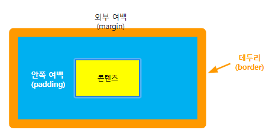

# 🎨 CSS 개요 및 기본 문법


### 1. CSS란 무엇인가?

- CSS: **Cascading Style Sheets**의 약자
- HTML이 "구조"를 담당한다면, CSS는 "스타일"을 담당함  
- 색상, 크기, 간격, 레이아웃, 폰트, 위치 등을 **화면에 어떻게 보일지** 정의하는 역할  
- 실제 웹사이트처럼 보이게 만드는 데 핵심적인 기술

### 2. CSS의 주요 기능

|기능|내용|
|-|-|
|레이아웃 제어|요소의 위치 지정 (position, flexbox, grid)
|색상 및 배경|텍스트 색상, 배경색, 배경 이미지 설정 (color, background)
|텍스트 스타일|글꼴, 크기, 줄 간격 설정 (font-family, font-size, line-height)
|여백 조정|요소 간 간격 (margin, padding)
|테두리 및 그림자|박스 테두리, 그림자 효과 (border, box-shadow)
|애니메이션 및 트랜지션|요소의 움직임 효과 (animation, transition)
|반응형 디자인|다양한 기기에서 최적화 (media queries, flexbox)

### 3. CSS의 적용 방법 3가지

| 방법 | 설명 | 예시 |
|------|------|------|
| 인라인(inline) | HTML 태그 안에 직접 | `<p style="color:red;">텍스트</p>` |
| 내부(internal) | `<style>` 태그 안에 작성 (HTML `<head>` 안) | `<style> p { color: red; } </style>` |
| **외부(external)** | 별도 `.css` 파일에서 불러옴 (💡 **추천 방식**) | `<link rel="stylesheet" href="style.css">` |


### 4. CSS 기본 문법

```css
선택자 {
  속성1: 값1;
  속성2: 값2;
}
```
```css
<style>
    p {
        color: blue;
        font-size: 16px;
    }
    h1{
        width: 100px; height: 50px; 
    }
</style>
```
- `선택자`: 어떤 HTML 요소에 적용할지 지정 (`p`, `.class`, `#id` 등)
- `속성`: 스타일 항목 (`color`, `font-size`, `margin`, `padding` 등)
- `값`: 속성에 적용할 값

### 5. CSS 선택자 종류
선택자란?
- css 적용 대상이 되는 요소를 선택하기 위한 지정자
- 선택자를 잘 활용하면 효율적으로 대상을 지정할 수 있음

<br>

<b>기본선택자<b>
| 선택자     | 의미             | 예시                       |
| ------- | -------------- | ------------------------ |
| 전체 선택자(`*`)  |모든 요소에 스타일 적용| `* { margin: 0; }`       |
| 태그 선택자(`p`, `div`, `h1`...)  | 특정 태그에 적용| `p {}`, `img{}`|
| 클래스 선택자(`.클래스명`) |선택된 클래스에 스타일 적용| `.title {}`              |
| ID 선택자(`#아이디명`)  |선택된 아이디에 스타일 적용| `#header {}`        |

<br>

<b>그룹 및 조합 선택자<b>
| 선택자     | 의미             | 예시                       |
| ------- | -------------- | ------------------------ |
| 그룹 선택자 (A`,` B)  | 여러 요소에 스타일 적용(and) | `h1, h2 { color: red; }` |
| 자식 선택자 (A`>`B)| A요소의 직계 자식만 선택 | `div > p {color: blue;}`  |
| 후손 선택자 (A` `B)| A요소의 모든 하위 요소 선택|`div img {border: 1px solid red;}`|
| 형제 선택자 (A`+`B)| A요소 바로 다음 형제 요소 선택|`h1 + p {color: red;}`|
| 일반 형제 선택자 (A`~`B)| A요소의 모든 형제 요소 선택|`h1 ~ p {color: gray}`|

<br>

<b>속성 선택자<b>
| 선택자     | 의미             | 예시                       |
| ------- | -------------- | ------------------------ |
| `[ attr ]` | 지정된 속성을 가진 요소 선택 |input[type] {background: blue;}|
| `[ attr="값" ]`|지정된 속성값과 일치하는 요소 선택|input[type="text"] {color: red;}|
| `[ attr^="값" ]`|지정된 속성값으로 시작하는 요소 선택|a[href^="/content"]{color: red;}|
| `[ attr$="값" ]`|지정된 속성값으로 끝나는 요소 선택|img[src$=".png"]{width: 200px;}|
| `[ attr*="값" ]`|지정된 속성값을 포함하는 요소 선택|h1[class*="wrap"]{color: red;}|

<br>

<b>가상 클래스(Pseudo) 선택자<b>
- 코드 상에 명시하지 않아도 아래의 상태에 대해서는 클래스가 있는 것으로 봄
 
| 선택자     | 의미             | 예시                       |
| ------- | -------------- | ------------------------ |
| `:hover` | 마우스를 올렸을 때 |a:hover{color: blue;}|
| `:focus` | 요소가 포커스 되었을 때 |img:focus{border 1px solid red;}|
| `:nth-child(n)` | n번째 자식 요소 선택 |li:nth-child(2){color: red};|
| `:first-child` | 첫 번째 자식 요소 선택 |h1:first-child{color: red};|
| `:last-child` | 마지막 자식 요소 선택 |h1:last-child{color: red};|
| `:not(selector)` | 특정 선택자를 제외하고 선택 |div:not(.box){color: red};|

<br>

<b>가상 요소 선택자<b>
- 실제 HTML 코드 상에는 존재하지 않는 요소도 선택의 대상이 될 수 있음

| 선택자     | 의미             | 예시                       |
| ------- | -------------- | ------------------------ |
| `::before` | 요소의 앞에 가상 요소 추가 |p::before {content: "data";}|
| `::after` | 요소의 뒤에 가상 요소 추가 |p::after {content: "data";}|
| `::first-letter` | 첫 글자 스타일 적용 |p::first-letter {color: "red";}||
| `::first-line` | 첫 줄 스타일 적용 |p::first-line {color: "red";}||

- 단, 대체 요소와 빈 요소는 `::before`, `::after`가 적용되지 않음
- 해결 1) 부모 요소 활용
```css
.img_container::after{
    content: "전등 이미지";
    display: block;
    text-align: center;
    font-size: 14px;
    color: gray;
}

<div class="img_container>
    
</div>
```
- 해결 2) figcaption 사용
- 해결 3) position: relative 활용

---

### 6. Box 모델
#### Box 모델이란?
- 모든 HTML요소를 박스로 취급하는 CSS 개념


---
<br>

### 7. inline / block
**태그의 유형**
- 모든 태그 요소는 inline 혹은 block으로 분류함

<br>

**Inline 형**
- 콘텐츠 크기만큼만 공간을 차지하는 요소
- 다른 요소와 수평 공간에서 공존이 가능
- 요소와 요소 간 줄 바꿈이 발생하지 않음

<br>

**Block 형**
- 화면 크기만큼 공간을 차지하는 요소
- 다른 요소의 수평 공간에서 공존 불가
- 요소와 요소 간 줄 바꿈을 발생시킴

<br>

**Inline vs Block**
|유형|padding|margin|width / height|
|-|-|-|-|
|Inline| left, right 적용가능 <br> 상하는 제대로 동작하지 않음 | left, right 적용 가능| 적용 불가|
|Blcok| 모든 방향 적용 가능| 모든 방향 적용 가능| 모두 적용 가능|

<br>

**inline-block**
- 인라인 방식의 수평 공존 특징을 유지, block 특징도 보유할 수 있는 혼합형
- 따라서 수평 공존을 유지하면서 padding, margin, width, height 적용 가능
---

### div 요소 내부 요소가 div 내부 위치를 벗어날 경우 안보이게 하기
```css
div{
    width: 1920px;
    height: 576px;
    overflow: hidden;
}
```